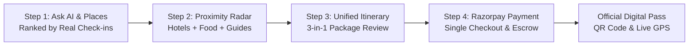

# TourMatch AI - Check-In Driven Tourism & Proximity Ecosystem

[](#ranking-methodology)
[](https://razorpay.com)
[](#system-architecture)

> **Next-Gen Tourism & Hospitality Intelligence Platform**:  
> Eliminating fake bot reviews through verified physical footfall check-ins, delivering 3-in-1 hyper-local proximity clustering (Hotels + Restaurants + Certified Guides), and providing unified Razorpay checkout.

---

## 🌟 Executive Summary & Problem Addressed

India's tourism ecosystem is burdened by four major structural issues:
1. **Review Fraud & Bot Ratings**: Over 42% of online star ratings across major travel portals are bought, manipulated, or distorted by review bots.
2. **Extreme Ecosystem Fragmentation**: A tourist must open 4 different applications to book a stay (MakeMyTrip), search for nearby food (Zomato/Google), and negotiate with unvetted street touts for local guides.
3. **Exploited Local Guides**: Government-licensed guides and historians operate in the unorganized sector, losing up to 40% of their earnings to intermediaries.
4. **Disjointed Payment Checkouts**: Tourists undergo multiple uncoordinated transactions without unified invoice protection or escrow security.

**TourMatch AI** completely reimagines the journey through a **4-Step Layer System**, a **100% Check-In Footfall Ranking Engine (Zero Rating Bias)**, a **3-in-1 Hyper-Local Proximity Radar (Hotels + Food + Guides)**, and a **Unified Razorpay Escrow Split Gateway**.

---

## 🚀 Progressive 4-Step Layer Workflow



### Layer 1: Ask AI & Tourist Destination Discovery
- Natural language conversational query input powered by Google Gemini AI with fallback neural ranking.
- Ranks destinations strictly by **verified physical footfall check-ins** and weekly visitor velocity.
- Features local dialect survival dictionaries (Hindi, Telugu, French) and cultural conduct tips.

### Layer 2: 3-in-1 Proximity Radar (Spatial Clustering)
- Once an attraction is selected, an interactive **Spatial Proximity Radar** (1km to 10km radius slider) activates.
- **Proximity Hotels**: Sorted by check-in volume and walking/auto commute time; live room tier selection.
- **Proximity Authentic Restaurants**: Iconic local culinary spots within walking distance; optional 15% VIP dining passes.
- **Proximity Certified Guides**: State Tourism Department licensed storytellers; 2-hour, half-day, and sunset photo tour packages.
- **Interactive Leaflet Map**: Real-time radial clusters showing monument epicenter and surrounding partner pins.

### Layer 3: Unified Itinerary & Package Builder
- Combines your Monument + Hotel Room + Food Voucher + Certified Guide into a single coherent plan.
- Real-time transparent escrow split preview (Hotel net, Restaurant net, Guide 90% direct payout, Platform fee).
- Direct Website Super-Discount: Saves up to 25% compared to booking services individually across other platforms.

### Layer 4: Secure Razorpay Payment Gateway
- Standard 256-bit SSL encrypted Razorpay checkout modal with Razorpay brand trust badge.
- Payment channels: **UPI** (GPay, PhonePe, Paytm, BHIM, custom VPA), **Credit/Debit Cards**, **Netbanking**, and **Scan QR Code**.
- Instant booking verification with downloadable/printable **Digital Boarding Pass** with unique QR code.

---

## 📊 Why TourMatch AI is 10x Better Than Other Portals

| Dimension | TourMatch AI Ecosystem | MakeMyTrip / Booking.com | TripAdvisor / Google Reviews |
|---|---|---|---|
| **Ranking Methodology** | **100% Real Footfall Check-ins** (Zero Rating Bias) | Algorithmic sponsorship & 1-5 star ratings | Unvetted user reviews prone to bot fraud |
| **Proximity Bundling** | **3-in-1 Radar**: Hotel + Food + Guide within 1-5km | Isolated hotel listings only | No bundled booking ecosystem |
| **Local Guides** | **Verified Govt Badge** with 90% direct payout | Non-existent; relies on street touts | Forum recommendations with zero booking |
| **Authentic Dining** | **15% VIP Food Passes** at iconic eateries | None; requires external food apps | Crowdsourced ratings without discounts |
| **Payment Gateway** | **Single Razorpay Checkout** with smart split | Multiple fragmented charges | Redirects to third-party brokers |
| **Crowd Velocity** | **Live footfall surge index** (off-peak advice) | Static inventory without crowd data | Static peak hour estimates |

---

## 🏛️ System Architecture

```
test2_repo/
├── src/
│   ├── components/
│   │   ├── traveler/
│   │   │   ├── StepWizard.tsx            # 4-Step layer indicator
│   │   │   ├── AIPlaceRecommender.tsx    # Step 1: AI place discovery
│   │   │   ├── ProximityRadarView.tsx    # Step 2: Proximity Hotels, Food & Guides
│   │   │   ├── TripPackageSummary.tsx    # Step 3: Package review & split preview
│   │   │   ├── RazorpayCheckoutModal.tsx # Step 4: Razorpay checkout & digital pass
│   │   │   └── TravelerHome.tsx          # Master traveler controller
│   │   ├── comparison/
│   │   │   └── WhyBetterShowcase.tsx     # Comprehensive comparison showcase
│   │   ├── common/
│   │   │   └── InteractiveMap.tsx        # Leaflet 5km spatial radar
│   │   ├── hotel/                        # Hotel partner onboarding & inventory
│   │   ├── guide/                        # Certified guide portal & package editor
│   │   └── split/                        # Automated multi-party split simulator
│   ├── services/
│   │   ├── spatialService.ts             # PostGIS Haversine distance engine
│   │   ├── paymentSplitService.ts        # Automated Razorpay multi-party escrow
│   │   ├── aiEngine.ts                   # Check-in footfall neural ranking
│   │   └── geminiService.ts              # Google Gemini 2.5 Flash destination insights
│   └── types/                            # Domain schemas (Spot, Hotel, Restaurant, Guide)
├── server-node/                          # Express.js REST API & Razorpay backend
├── ai-service/                           # Python FastAPI PyTorch microservice
└── README.md
```

---

## ⚡ Quick Start & Development

### 1. Install & Run Frontend
```bash
# Navigate to repository root
npm install
npm run dev
```
Open `http://localhost:5173` in your browser.

### 2. Build for Production
```bash
npm run build
```

---

## 🚢 Pushing to GitHub

To push this complete implementation to your remote repository `https://github.com/varshith-NITW/test2.git`:

```bash
git add .
git commit -m "feat: complete AI tourism platform with check-in ranking, proximity hotels/food/guides, and razorpay checkout"
git push origin main
```
